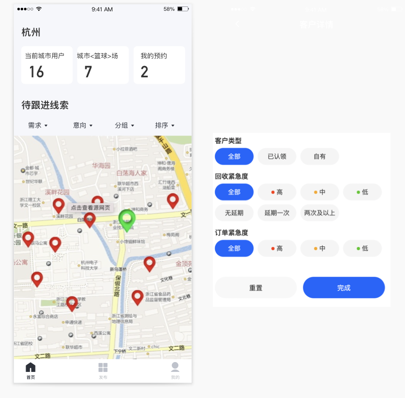

# go-to

分享运动场地的应用

## 需求文档

### 页面预览

底部导航依次为：地图  发布  我的

* 地图功能为展示场地的地图，其上有搜索框（待定）和筛选条件，如可以选择具体城市，体育种类（篮球羽毛球等），是否收费，已经后续可能增加字段（考虑一下如果增加字段，怎么同步已有数据）

  * 地图中点击表示可以进入球场详情

    

    

* 约球功能后续想发展为社区互动，提供线下约球交流的地方，可以在发布中发布一条约球信息（类似一个文章），该页面也提供筛选，入城市，种类等

  

* 发布可以发布场地信息，以及约球信息

  * 场地信息包含，场地名称（如公共篮球场），地址（预想包含经纬度即可，用户输入时，可以根据地图定位），是否免费，进入限制（是否对外部人员开放这种），描述（篮球场地具体的描述），并开设评论功能（文字评论，评论可点赞，高赞排前）
  * 约球信息，标题，参与人数，现有人数（会实时增加参与人数），难度等级（菜鸟、一般、大佬啥的这种），有效时间（过期将不会在约球中展示，但是发布人可以查询到，并且以前的评论不会删除，可以在回复中导向回来），也开设评论功能（时间顺序排名）
    * 用户可以预约该场次，同一时间段不能约两场（根据具体时间算）

* 消息中可以看到评论的消息，可以回复评论，也可以回复发布内容

  

* 我的中展示发布功能，可以查看发布的球场，和发布的约球信息

  * 球场可以选择修改和删除，约球信息可以修改删除
  * 展示预约的约球列表
  * 我的中展示修改用户信息功能（头像，签名，所在地，爱好）
  * 管理员功能：查看在线人数（根据session查看），注册人数，删除评论

# 模型

## 球场

类似大众点评，当有用户发布一个球场后，其余用户可以在该球场下评论，根据评论点赞数，设置排序

球场的发布，同一地点不能再次发布，但可对其进行修改（发布时弹出选项，发布新的或修改已有）

用户可以标注虚假信息，当标注虚假过多，将对其进行删除

在地图上点击某一个球场后，将会弹出球场详情，详情页类似淘宝，有三个tab，详情，评论，约球

详情展示球场信息

评论展示评论

约球按发布时间，展示相应的item
